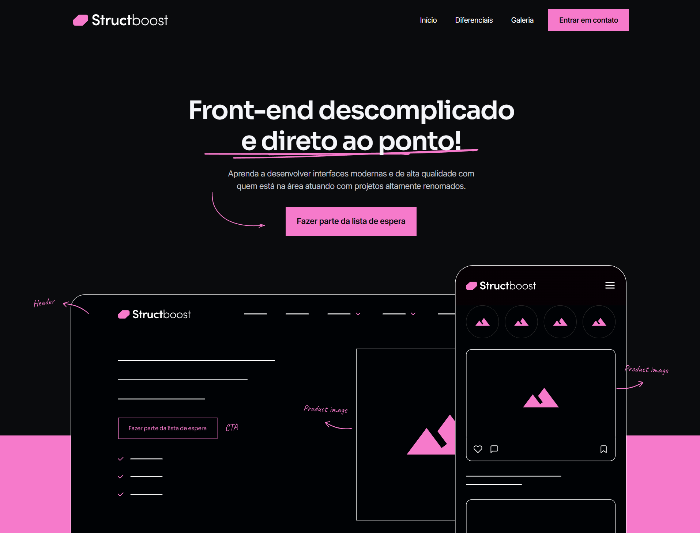

# StructBoost

O Strucboost é uma landing page desenvolvida para consolidar conceitos fundamentais e avançados de Front-end. O projeto faz parte dos estudos práticos do treinamento ministrado pelo mentor Will Moreira ([Codeboost](https://codeboost.com.br/)).  

[Visualizar projeto ao vivo](https://ferlimatos.github.io/CODEBOOST-structboost/)

## Aprendizado:
- **HTML5 & Semântica**: Estruturei o código com foco em hierarquia e acessibilidade.
- **CSS3 Avançado**: Dominei o uso de Flexbox/Grid para layouts e z-index para o gerenciamento de camadas.
- **Arquitetura Modular**: Organizei os estilos de forma escalável, separando arquivos para Reset, Variáveis, Fonts, Grid e Componentes.
- **Design-to-Code**: Realizei a extração técnica de ativos (SVG/Imagens) do Figma e a integração de Google Fonts.
- **Responsividade**: Apliquei Media Queries para garantir uma experiência fluida em dispositivos desktop e mobile.

## Tecnologias

Neste projeto foram utilizadas as seguintes tecnologias:

